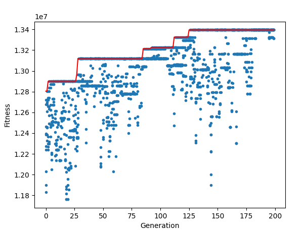

# Genetic Algorithm for the Knapsack Problem

    

## Overview

This project demonstrates the use of a genetic algorithm to solve the knapsack problem. The goal is to maximize the total value of items that can be placed in a knapsack without exceeding its weight capacity. The project includes generating an initial population, evaluating fitness, selecting parents, performing crossover and mutation, and evolving the population over generations.

## Data Exploration and Preprocessing

The `data.py` file contains functions to handle data loading and preprocessing:

- `get_small()`: Loads a small knapsack dataset and returns the items and maximum capacity.
- `get_big()`: Loads a large knapsack dataset and returns the items and maximum capacity.

## Genetic Algorithm

The main script (`main.py`) implements the genetic algorithm to solve the knapsack problem:

- **Initial Population**: Generates an initial population of individuals with random solutions.
- **Fitness Function**: Calculates the fitness of an individual based on the total value of items without exceeding the weight capacity.
- **Selection**: Selects individuals from the population using a roulette wheel selection based on their fitness.
- **Crossover**: Combines two parents to produce offspring by exchanging segments of their solutions.
- **Mutation**: Randomly mutates genes in an individual's solution with a small probability.
- **Evolution**: Evolves the population over a specified number of generations, keeping track of the best solution found.

## Results

The script outputs the following results:

- Best solution found and its value.
- Time taken to find the best solution.
- Plots showing the fitness of individuals over generations and the progression of the best fitness.

